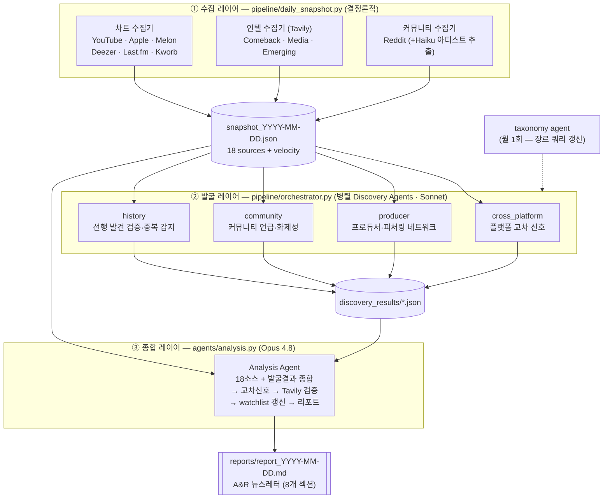

# 🎵 Music Trend Agent

> 18개 음악 데이터 소스를 매일 수집하고, 멀티 에이전트가 교차 분석해 **메이저 매체가 보도하기 전에** 신흥 신호를 포착하는 K-pop A&R 인텔리전스 파이프라인.

전직 K-pop A&R의 도메인 지식을 멀티 에이전트 오케스트레이션으로 구현한 개인 프로젝트입니다.

📄 **실제 산출물 예시 → [examples/sample_report_2026-06-20.md](examples/sample_report_2026-06-20.md)** (파이프라인이 매일 만드는 A&R 리포트 한 장)

---

## 문제 정의

A&R(Artists & Repertoire)·프로듀서는 매일 같은 질문을 마주합니다 — **"지금 뭐가 되고 있나?"**

문제는 *답을 알았을 때는 이미 늦다*는 데 있습니다. Billboard·Rolling Stone·Pitchfork가 어떤 아티스트를 다룰 때쯤이면, 그 신호는 차트에 충분히 올라온 **강신호**입니다. 강신호는 누구나 봅니다. A&R의 경쟁력은 차트에 오르기 전, 여러 플랫폼에서 같은 아티스트·사운드가 **겹치기 시작하는 순간**(약신호)을 먼저 잡는 데 있습니다.

이 프로젝트는 그 약신호 포착을 자동화합니다:

- **신호는 어디서 올지 모른다** → 차트·Rising·미디어·커뮤니티·장르 움직임까지 18개 소스를 동시에 본다
- **freshness ≠ strength** → 고velocity 강신호만 잡으면 가치가 없다. 약신호·조기 신호 우선
- **메이저 매체는 검증 레이어** → "우리가 먼저 잡았나, 나중에 잡았나"를 항상 추적

---

## 아키텍처

수집(deterministic) → 발굴(병렬 LLM 에이전트) → 종합(LLM 에이전트)의 3단 파이프라인입니다.



**에이전트별 도구 (Claude tool calling)**
| 레이어 | 에이전트 | 모델 | 핵심 도구 |
|--------|----------|------|-----------|
| 발굴 | cross_platform / producer / community / history | Sonnet 4 | `search_web` (Tavily), `add_to_watchlist`, `flag_signal`, `save_result` |
| 종합 | analysis | Opus 4.8 | `search_web`, `cache_artist_analysis`, `generate_report` |
| 보조 | reddit 아티스트 추출 | Haiku 4.5 | — (일괄 추출, 정규식 검증) |

병렬 실행은 [orchestrator.py](pipeline/orchestrator.py)가 그룹 단위로 처리하며, API rate limit window 회복을 위해 그룹 간 45초 대기를 둡니다. 멱등성은 날짜별 `.done` 플래그([run_daily.sh](run_daily.sh))로 보장 — 하루 중 재실행해도 완료된 단계는 건너뜁니다.

---

## 기술 스택

- **언어:** Python 3.12 (venv)
- **AI:** Claude API — Opus 4.8 (종합) / Sonnet 4 (발굴) / Haiku 4.5 (추출), tool calling 기반 자율 에이전트
- **웹 검색:** Tavily API (무료 티어 ~1,000회/월)
- **저장:** JSON 파일 (스냅샷·watchlist·discovery 결과·캐시)
- **스케줄링:** cron (로컬 Mac, `run_daily.sh` wrapper)
- **수집:** REST API + RSS + HTML 스크래핑 (requests)

---

## 데이터 소스 (18개)

매일 한 스냅샷에 통합되며, 어제 스냅샷이 있으면 velocity(순위/조회수/playcount 변화)를 자동 계산합니다.

| # | 소스 | 수집 방식 | 신뢰도 | 상태 |
|---|------|-----------|--------|------|
| 1 | YouTube Trending KR | YouTube Data API v3 | 높음 | ✅ |
| 2 | YouTube Rising (글로벌) | YouTube Data API v3 (4중 필터) | 높음 | ✅ |
| 3 | Apple Music KR | Apple Music RSS | 높음 | ✅ |
| 4 | Apple Music US | Apple Music RSS | 높음 | ✅ |
| 5 | Apple Music JP | Apple Music RSS | 높음 | ✅ |
| 6 | Apple Music GB | Apple Music RSS | 높음 | ✅ |
| 7 | Melon TOP100 (한국 국민 차트) | HTML 스크래핑 | 높음 | ✅ |
| 8 | Melon HOT100 (실시간) | HTML 스크래핑 | 중간¹ | ✅ |
| 9 | Deezer Global | Deezer API | 낮음² | ⚠️ |
| 10 | Last.fm Global | Last.fm API | 중간 | ✅ |
| 11 | Last.fm US | Last.fm API | 중간 | ✅ |
| 12 | Last.fm UK | Last.fm API | 중간 | ✅ |
| 13 | Last.fm Genre Tags (장르 모멘텀) | Last.fm API | 중간 | ✅ |
| 14 | Kworb Apple Music Worldwide | HTML 스크래핑 | 중간 | ✅ |
| 15 | K-pop Comeback Intel | Tavily (동적 검색) | 중간 | ✅ |
| 16 | Media Coverage (Billboard/Pitchfork/RS) | Tavily | 보정³ | ✅ |
| 17 | Emerging Artist Intel (프로듀서 순환+피처링) | Tavily | 중간 | ✅ |
| 18 | Reddit Signals (popheads/kpop/indieheads) | Reddit JSON + Haiku 추출 | 중간 | ✅ |

¹ HOT100 슬라이스가 다중 트랙 앨범 컴백을 단일 곡처럼 인식하는 버그 존재 → 아티스트별 그룹핑으로 보정 중.
² Deezer는 특정 아티스트가 상위권을 도배하는 anomaly가 잦아, 자동 감지 후 신뢰도 플래그를 내림(교차 참고용).
³ Media Coverage는 *발굴* 소스가 아니라 "⭐ 우리가 먼저" 오판을 막는 **검증·보정** 소스.

**차단/보류된 소스**
| 소스 | 사유 |
|------|------|
| Spotify | Audio Features API 폐쇄 (2026) — 음원 기반 신호 접근 불가 |
| Shazam | 비공식 라이브러리 차단 |
| TikTok | ToS 및 Research API 구조적 차단 |

음원 기반(BPM·키·음색) 신호는 텍스트 에이전트로 접근 불가하여, 별도 프로젝트(SoundTag)의 taxonomy 산출물로만 보완합니다.

---

## 설계 결정과 트레이드오프

### 왜 멀티 에이전트인가

단일 에이전트에 18개 소스를 통째로 넣고 "분석해"라고 하면, 컨텍스트가 길어질수록 각 관점이 평균으로 수렴해 *뭉툭한* 결과가 나옵니다. A&R 발굴은 **서로 다른 시선**의 문제입니다 — 플랫폼 교차를 보는 눈, 프로듀서 네트워크를 보는 눈, 커뮤니티 온도를 보는 눈은 각각 다른 검색 전략과 다른 판단 기준을 씁니다.

그래서 발굴을 4개의 전문 에이전트로 분리했습니다. 각자 독립된 시스템 프롬프트·검색 쿼리·watchlist 접근 권한을 갖고 **병렬로** 돌며, 종합 에이전트(Opus)가 이들의 결과 + 원본 스냅샷을 함께 받아 최종 판단을 합니다.

- **트레이드오프:** 에이전트 수만큼 API 호출·비용·rate limit 압박이 늘고, 오케스트레이션 복잡도가 생깁니다. → 발굴(Sonnet)/종합(Opus)/추출(Haiku)로 모델 티어를 나눠 비용을 통제하고, 그룹별 순차+그룹내 병렬 + 45초 대기로 rate limit을 회피합니다.
- **모델 선택:** 발굴은 넓게 빠르게(Sonnet), 최종 판단은 깊게(Opus), 단순 추출은 싸게(Haiku).

### 왜 JSON 파일인가 (DB 아님)

현재 단일 사용자, 누적 데이터 ~0.84MB 규모입니다. 이 규모에서 DB는 운영 부담만 늘립니다.

- 날짜별 스냅샷 JSON은 그 자체로 불변(immutable) 시계열이라 velocity 계산·재현·디버깅이 단순합니다 (`load_snapshot(yesterday)` 한 줄).
- 에이전트 간 통신도 파일 경로 하나로 끝납니다 — discovery 결과를 `discovery_results/*.json`에 쓰면 종합 에이전트가 읽습니다. 메시지 큐가 필요 없습니다.
- **트레이드오프:** 시계열 쿼리·인덱싱이 약합니다. → Phase 3 시계열 분석 단계에서 DB 마이그레이션을 재검토하기로 보류.

### 멱등 파이프라인

cron이 하루 여러 번 돌거나 중간에 실패해도 안전하도록, 각 단계(snapshot/orchestrator/analysis)를 날짜별 `.done` 플래그로 가드합니다. 완료된 단계는 재실행 시 건너뛰고, 실패한 단계만 다시 시도합니다.

---

## 한계와 학습

이 프로젝트의 가장 중요한 학습은 **"큐레이션 품질은 필터 문제가 아니다"** 입니다.

초기 가설은 "더 좋은 정량 신호(조회수·랭크·velocity)를 더 잘 골라내면 좋은 리포트가 나온다"였습니다. 틀렸습니다. 정량적으로 "강한" 신호만 선별하니, **같은 아티스트가 며칠씩 헤드라인을 돌려막는** 결과가 나왔습니다. 강신호는 정의상 이미 모두가 아는 신호이기 때문입니다 — 애초에 잡으려던 약신호와 정반대.

여기서 핵심 깨달음:

> 진짜 A&R 큐레이션은 다요인 **주관 판단(시선)**이라 체크리스트·억제 룰로 환원되지 않는다. 정량 룰을 추가하는 모든 패치는 *같은 실패의 다른 형태*다.

그래서 이 레포는 **정량 선별 룰·억제 룰 추가를 금지**합니다([CLAUDE.md](CLAUDE.md) 절대 규칙 #1). 룰은 추가가 아니라 삭제 방향이며, 성공 지표는 "예시 N개가 룰 M개를 대체했다"입니다.

**진행 중인 해법 — Path 2 (예시 기반 학습):** 실제 스냅샷에서 끌리는/안 끌리는 신호를 *이유 설명 없이* O/X로 라벨링하고([scripts/curation_labeler.py](scripts/curation_labeler.py)), 에이전트가 few-shot으로 패턴을 귀납 학습합니다. 시선은 룰이 아니라 예시로만 전달됩니다.

### 알려진 한계

- **발굴(##9 "우리가 먼저") 약함:** 프롬프트 정제로 풀리지 않는 *소스 커버리지* 문제. Discovery 소스 확장(Pitchfork Rising, Bandcamp Daily, The FADER 등)이 구조적 해법이나, 베타 독자 피드백으로 확인 후 착수 예정.
- **음원 신호 부재:** Spotify Audio Features 폐쇄로 BPM·키·음색 기반 분석 불가. 텍스트 메타데이터로만 사운드를 다룸.
- **데이터 정합성 우선순위:** 거짓 freshness·연속일 주장 오류·교차 날짜 불일치는 신뢰도를 직접 훼손하므로, 편집 품질 개선보다 *이력 정확성 검증*을 먼저 둠.

### 현재 상태

> ⏸️ **`PAUSE_ANALYSIS=true`** — Path 2 큐레이션 재설계 기간 동안 분석·리포트 생성은 일시 정지하고, 시선 학습용 **스냅샷 수집만** 매일 가동 중입니다. 정량 강도순 리포트를 더 찍어내는 것은 같은 실패를 반복할 뿐이라는 판단.

---

## 설치

```bash
git clone https://github.com/zoecodes-dev/music-trend-agent.git
cd music-trend-agent

python3.12 -m venv venv && source venv/bin/activate
pip install -r requirements.txt

cp .env.example .env      # 그리고 4개 키 값을 채운다
```

필요한 API 키 4개 (모두 무료 티어 존재): `ANTHROPIC_API_KEY` · `TAVILY_API_KEY` · `YOUTUBE_API_KEY` · `LASTFM_API_KEY`. 키 발급처는 [.env.example](.env.example) 주석 참조. 런타임에 필요한 디렉터리(`data/`·`snapshots/`·`logs/` 등)는 코드가 자동 생성한다.

## 실행

```bash
bash run_daily.sh                              # 전체 파이프라인 (cron 진입점)
python pipeline/daily_snapshot.py              # 수집만 (기본 — PAUSE_ANALYSIS=true)
python pipeline/orchestrator.py                # 발굴 에이전트 병렬 실행
python agents/analysis.py                      # 종합·리포트 생성
python scripts/curation_labeler.py --days 7    # Path 2 라벨링 도구
python scripts/diagnose_reports.py             # 리포트 진단
python scripts/newsletter_deepen.py --pick "…" # ##6 인사이트 뉴스레터 심화 (선택)
```

> 클론 직후 `bash run_daily.sh`는 `PAUSE_ANALYSIS=true`라 **수집(snapshot)만** 돕니다. 분석·리포트까지 보려면 [run_daily.sh](run_daily.sh)에서 플래그를 `false`로.

---

## 프로젝트 구조

```
music-trend-agent/
├── pipeline/                  # 파이프라인 진입점
│   ├── daily_snapshot.py      #   ① 18개 소스 통합 수집 + velocity 계산
│   └── orchestrator.py        #   ② Discovery 에이전트 병렬 오케스트레이션
├── agents/                    # LLM 에이전트
│   ├── analysis.py            #   ③ 종합 에이전트 (Opus) — 리포트 생성
│   ├── cross_platform.py      #   발굴: 플랫폼 교차 겹침
│   ├── producer.py            #   발굴: 프로듀서·피처링 네트워크
│   ├── community.py           #   발굴: 커뮤니티 온도
│   ├── history.py             #   발굴: '우리가 먼저' 검증·중복 감지
│   └── taxonomy.py            #   월 1회: 장르 쿼리 갱신
├── collectors/                # 소스별 수집기 (12개 모듈)
├── utils/                     # tool_handlers · watchlist · normalize
├── scripts/                   # 운영 도구 (라벨링·진단·큐 관리·뉴스레터 심화)
├── snapshots/                 # 날짜별 스냅샷 JSON (gitignored)
├── discovery_results/         # 발굴 에이전트 결과 JSON (gitignored)
├── reports/                   # 생성된 리포트 MD (gitignored)
└── run_daily.sh               # cron wrapper (멱등 플래그 가드)
```

---

*Built by Zoe — 전직 K-pop A&R · AI 엔지니어. 도메인 지식을 멀티 에이전트 시스템으로 옮기는 실험.*
